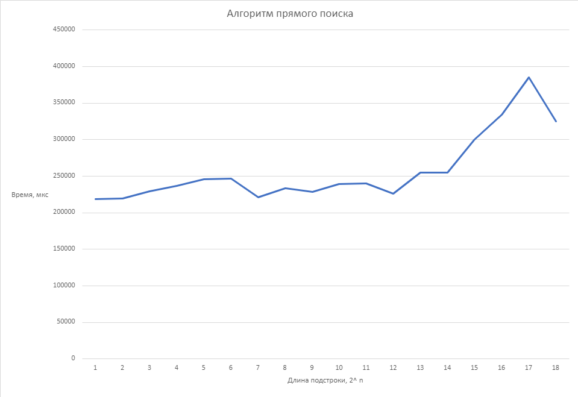
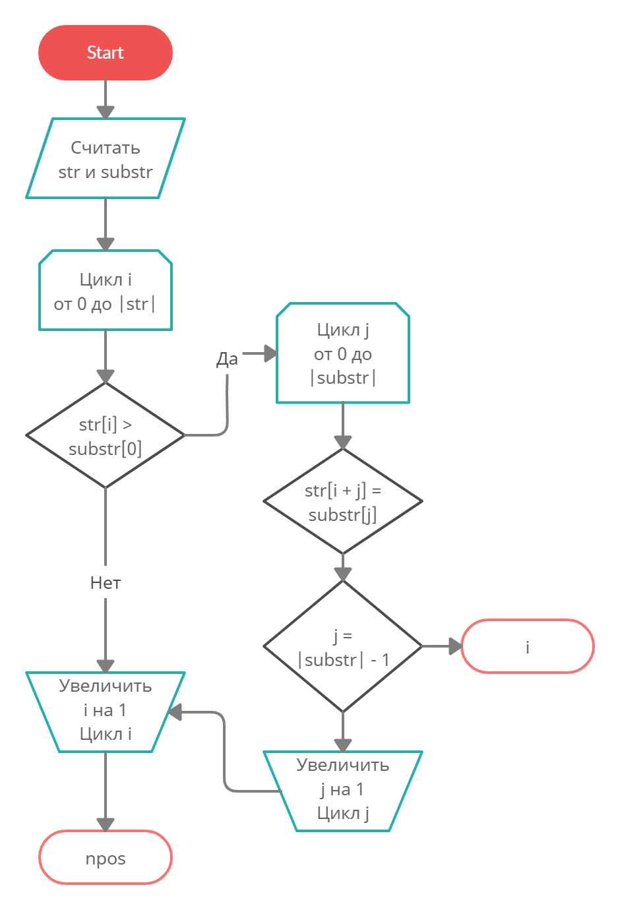
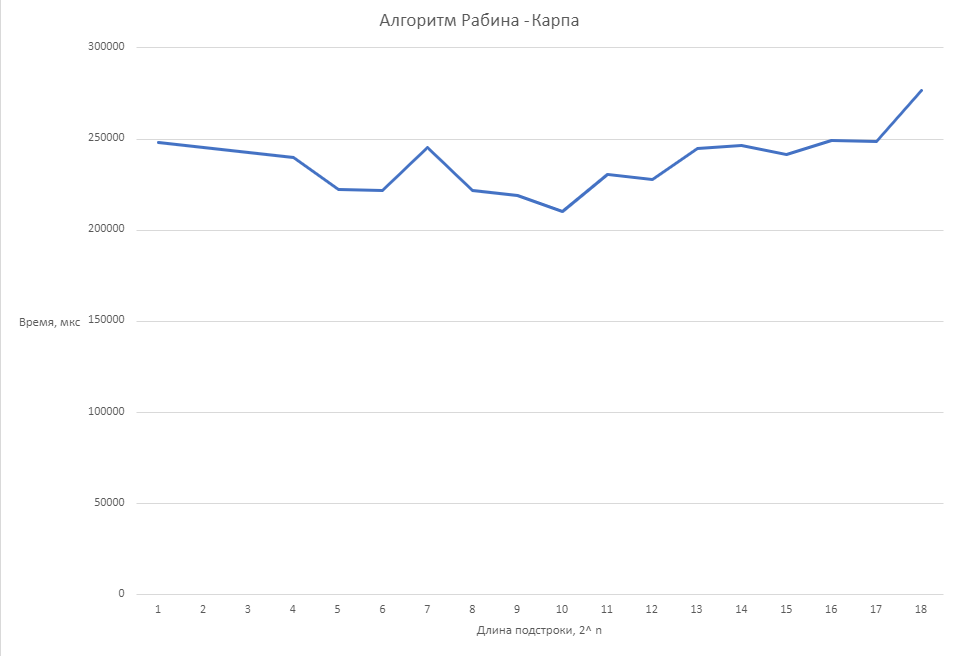
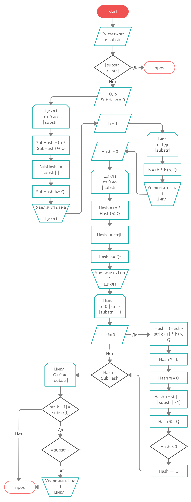
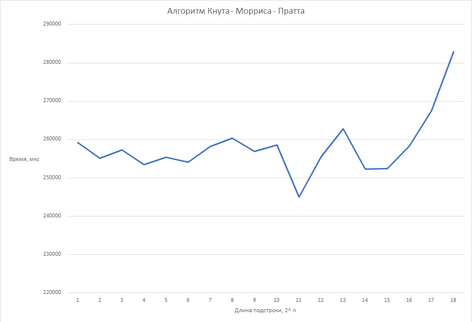
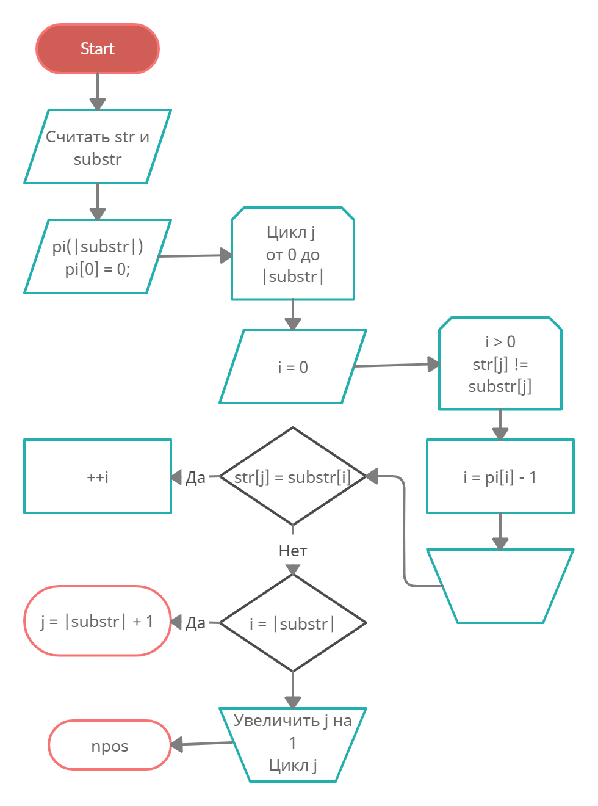
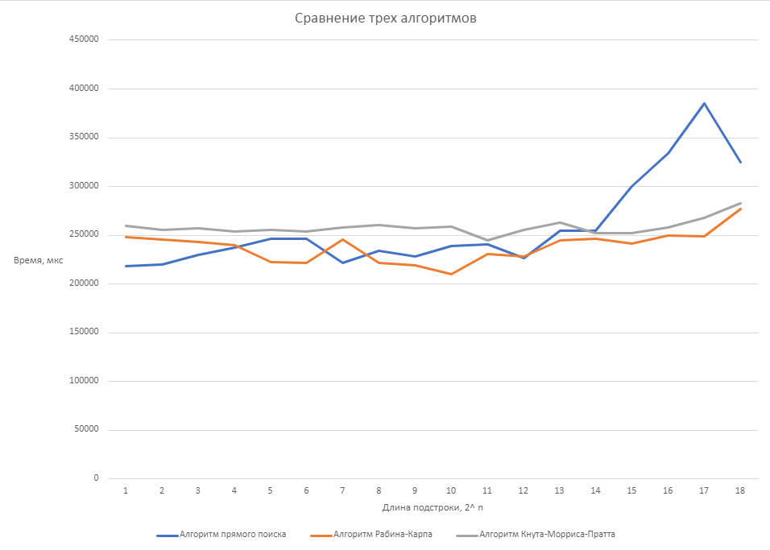

# Лабораторная работа №3

## Алгоритм прямого поиска

Примитивный алгоритм. Реализуется вложением циклов: изначально происходит поиск первого совпадающего символа, следом идет сравнение со всей подстрокой. Неплохо справляется с небольшим объемом входных данных, далее идет существенное увеличение времени поиска. Можно сделать вывод: использование алгоритма прямого поиска нецелесообразно, следует отдать предпочтение более эффективным алгоритмам.

## Алгоритм Рабина-Карпа

Алгоритм, использующий полиноминальный хеш и модульную арифметику. Происходит вычисление хеша подстроки, затем его поочередное сравнение с хешем фрагмента строки. В случае совпадения подстроки сравниваются. Для повышения эффективности алгоритма используется скользящий хеш. Он позволяет избежать повторного вычисления хеша для каждой подстроки. Во избежание переполнения используется оператор %. Стабильно справляется с любой длиной строк, что, несомненно, плюс.

## Алгоритм Кнута-Морриса-Пратта

Алгоритм, в основе которого лежит работа с префиксами и суффиксами. Требует выделения памяти под массив префиксов. С увеличением объема входных данных время поиска значительно возрастает.

## Сравнение трех алгоритмов

Алгоритм прямого поиска проигрывает, когда речь идет о работе с большим объемом данных. К удивлению, алгоритм Рабина-Карпа показал себя лучше, нежели алгоритм Кнута-Морриса-Пратта, что, возможно, связано с погрешностью измерений. 

## Вывод
Несложно сделать вывод: использование алгоритмов — ключ к эффективной работе программы.
